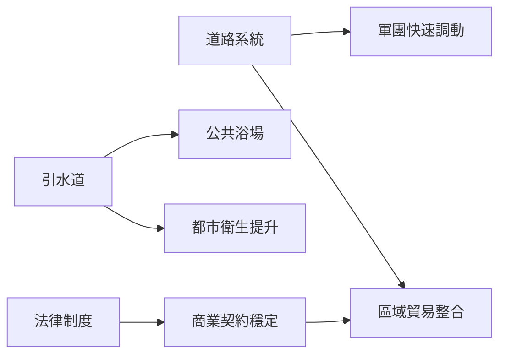

  
HISTORIA ROMAE

  <h1 class="hero-title">古羅馬歷史導覽</h1>
  
從台伯河畔小城到地中海霸權

  
圖文版簡報｜台灣正體中文

---
layout: image-right
image: https://upload.wikimedia.org/wikipedia/commons/d/de/Colosseo_2020.jpg
backgroundSize: cover
class: warm-overlay
---

# 羅馬在哪裡？

羅馬位於今日義大利中部，起源於台伯河（Tiber）沿岸。

<v-clicks>

- 地理優勢：接近地中海航運網路
- 易守難攻：丘陵地形有利防禦
- 吸收能力強：善於整合周邊民族文化

</v-clicks>

---
layout: section
class: section-band
---

# 一、王政時期

西元前 753 年（傳說）至前 509 年

---
layout: two-cols
class: parchment
---

# 王政時期重點

- 傳說建城者：羅慕路斯（Romulus）
- 七王時代逐步形成城市制度
- 伊特魯里亞文化影響深遠
- 前 509 年推翻末代國王，走向共和

::right::

象徵羅馬建城傳說

---
layout: section
class: section-band
---

# 二、共和時期

西元前 509 年至前 27 年

---
layout: two-cols-header
class: parchment
---

# 共和制度與擴張

::left::

## 政治制度

- 元老院：貴族政治核心
- 執政官：每年選出 2 位
- 平民會議：平民政治權利逐漸擴大

## 社會矛盾

- 貴族與平民長期角力
- 土地與軍役負擔不均

::right::

## 軍事與版圖

- 經過布匿戰爭擊敗迦太基
- 控制西地中海後持續東擴
- 前 2 世紀成為地中海強權

---
layout: image-left
image: https://upload.wikimedia.org/wikipedia/commons/9/96/Bust_of_Julius_Caesar.jpg
backgroundSize: contain
class: warm-overlay
---

# 共和末期轉折：凱薩

- 凱薩在高盧戰爭建立威望
- 前 49 年渡過盧比孔河，引發內戰
- 成為終身獨裁官後於前 44 年遭刺殺
- 共和制度名存實亡，帝制即將到來

---
layout: section
class: section-band
---

# 三、帝國時期

西元前 27 年至西元 476 年（西羅馬）

---
layout: two-cols
class: parchment
---

# 從奧古斯都到五賢帝

- 奧古斯都建立元首制（Principate）
- 前後約兩世紀「羅馬和平」（Pax Romana）
- 道路、港口、引水道促進整體繁榮
- 法律、行政與軍隊制度高度成熟

::right::

---
layout: center
class: parchment
---

# 羅馬工程與城市文明

---
layout: image-right
image: https://upload.wikimedia.org/wikipedia/commons/d/de/Colosseo_2020.jpg
backgroundSize: cover
class: warm-overlay
---

# 帝國危機與分裂

<v-clicks>

- 3 世紀危機：政治動盪、經濟壓力、邊境威脅
- 戴克里先改革：四帝共治，強化行政管理
- 君士坦丁重整帝國，遷都君士坦丁堡
- 西元 395 年後東西正式分治
- 西元 476 年西羅馬滅亡，東羅馬延續

</v-clicks>

---
layout: two-cols
class: parchment
---

# 羅馬的長期影響

## 制度與思想

- 羅馬法影響近代法治精神
- 公民權概念影響現代政治
- 拉丁文塑造多種歐洲語言

## 文化與技術

- 拱券、穹頂、混凝土建築技術
- 城市治理與基礎建設範式

::right::

---
layout: center
class: timeline-slide
---

# 重點時間軸

| 年代 | 事件 |
|---|---|
| 前 753（傳說） | 羅馬建城 |
| 前 509 | 王政結束，共和開始 |
| 前 264–146 | 布匿戰爭 |
| 前 44 | 凱薩遭刺殺 |
| 前 27 | 奧古斯都開啟帝國 |
| 西元 395 | 東西羅馬分治 |
| 西元 476 | 西羅馬帝國滅亡 |

---
layout: end
class: hero-end
---

# 謝謝聆聽

古羅馬不只是「帝國興亡史」，
更是制度、法律與城市文明的長期實驗。

可延伸主題：羅馬軍團、羅馬法、基督教與帝國轉型

